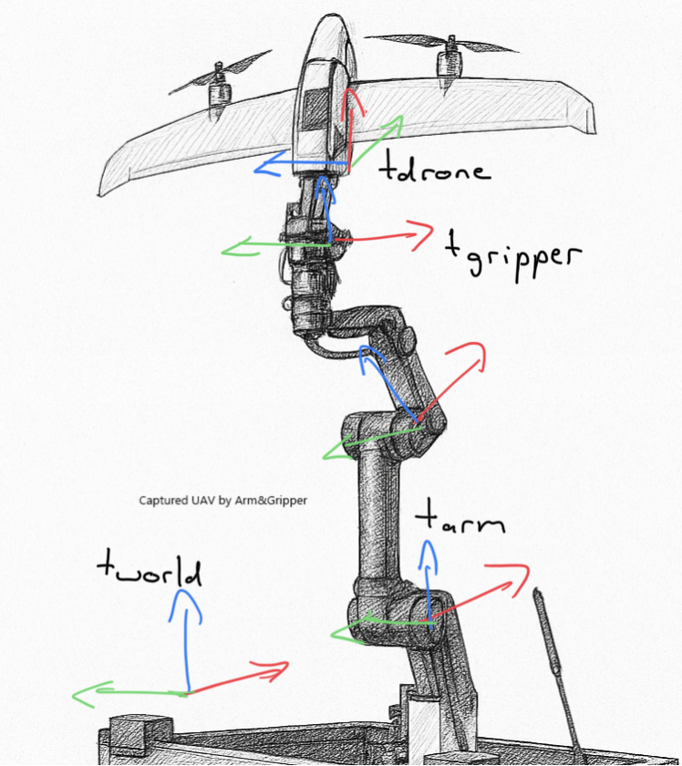
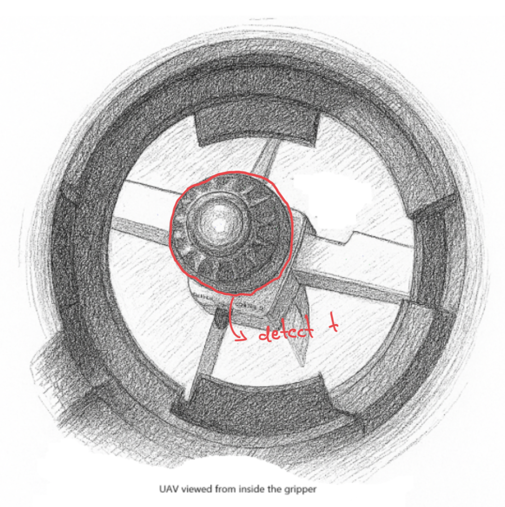
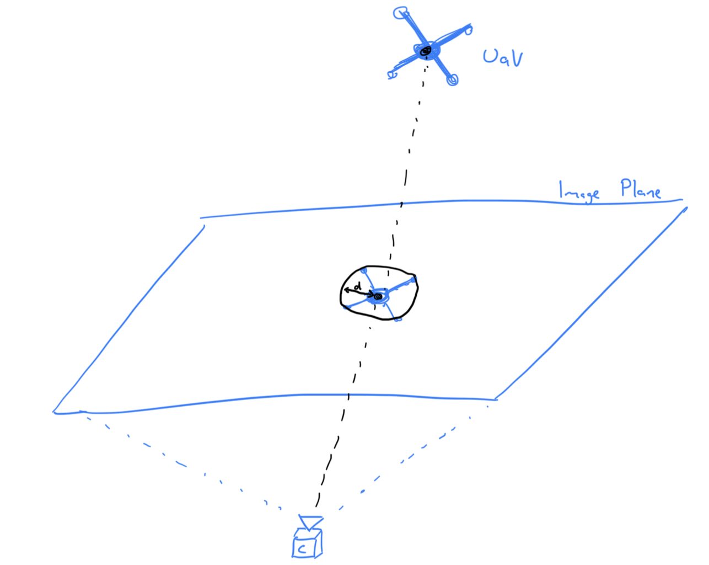
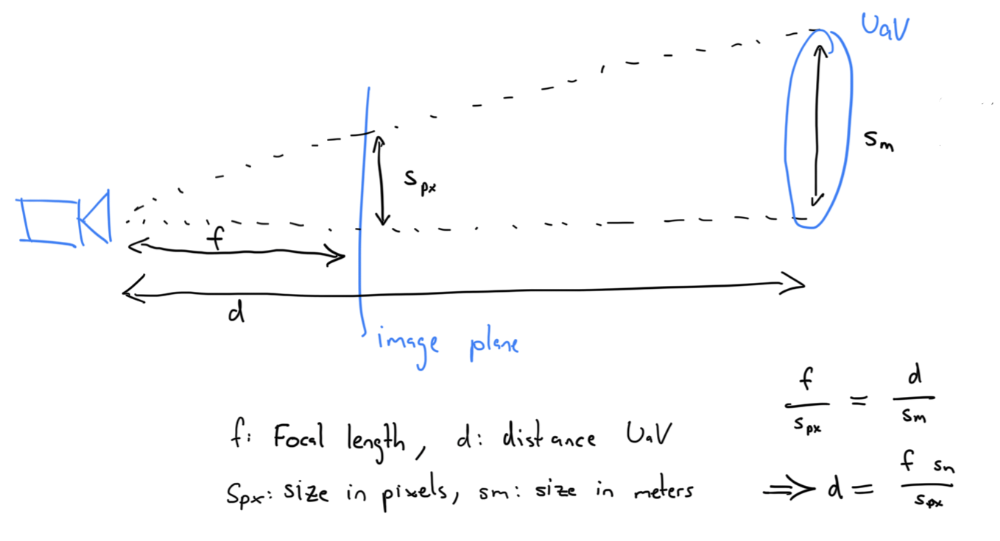
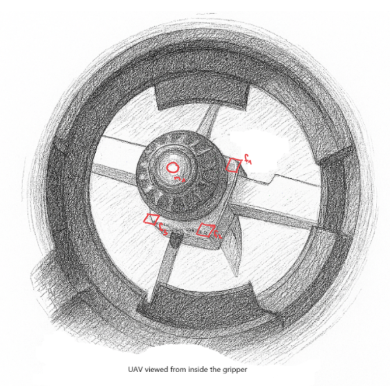
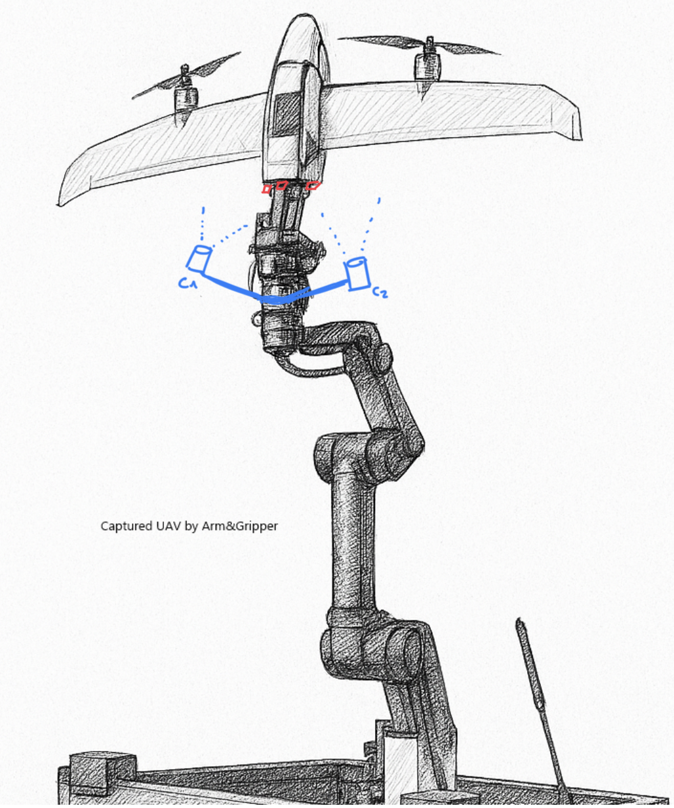

# Task 1 (C++)

The original code starts two worker threads that each run a process loop until one thread signals to stop or a timeout is hit.
While the code is correct, there are some issues with how the function is referenced from the thread. An unsuspecting user could let the passed function go out of scope, leaving the thread with a dangling reference to a destroyed object.

Full solution and reasoning as comments inside the `cpp_task.cpp` file.

# Task 2 (Python)

Rotate the matrix by first transposing it and then reversing each row. This is done in place by iterating only the upper triangle and swapping each mirror pair, avoiding a second matrix. O(n²) time, O(1) extra space.

Full solution in `python_task.py`.

# Task 3 (DronePort)

## Q1: What kind of algorithm could be used to track ( 3d i.e. XYZ axes) and capture the drone?

### Overview
For this problem, having a ROS2 system with a node being responsible for tracking, and another node being responsible for moving the robot arm would probably be a good start.
Another node could capture and publish the camera images.

The full transform chain needed to drive the gripper to the drone is `arm base -> end-effector -> camera -> drone`. In a ROS2 setup this is typically managed via `tf2`, with the arm publishing its kinematic chain and the hand-eye calibration supplying the camera-to-end-effector transform. The tracking node publishes the relative drone position after detecting it successfully.



Keeping it modular like this means we can easily add different sensors later, change the camera, change the robot arm, ...
This would also mean that we can use open-source solutions where applicable, e.g. to plan the path of the robot arm.

### Preprocessing
Calibrate the camera (intrinsics) and calibrate the position of the camera on the gripper using a hand-eye calibration (extrinsic).

Preprocess the image by rectifying (based on camera calibration), and creating a binary mask for the regions occupied by the gripper. Pixels falling inside the mask regions can be ignored in the next steps.

### Simple Detection

Detect the back of the UAV by tracking its black circular capture mechanism $t$ using OpenCV blob detection. Since at this stage we do not need color info (assuming $t$ is black), we can first convert the image to grayscale.


```python
image = cv2.cvtColor(image, cv2.COLOR_BGR2GRAY)
detector = cv2.SimpleBlobDetector_create()
keypoints = detector.detect(image)
```

Likely we will get more than one keypoint. We can filter the keypoints using different metrics (convexity, color, size, ...) until we arrive at a single blob we expect to be the drone.

The x,y coordinates can be estimated using camera calibration, projecting a ray through the center of the blob.


After having the direction, the distance can be estimated based on the size of the blob. Correlating the blob size $s_{px}$ with the known size $s_m$ of the drone's capture mechanism $t$, and the focal length of the camera $f$, a distance between camera and drone can be calculated.

Note: a fast-approaching drone can cause motion blur (and rolling-shutter skew on consumer sensors), which smears the blob and breaks the size-based depth estimate. A global-shutter camera and short exposure times are the standard mitigations.

$$
d = \frac{f s_m}{s_{px}}
$$




### Additional steps for detection (if simple solution fails/not robust enough)

Train an object detection model (e.g. YOLO) to detect the back of the UAV. 
This could be done by creating a small dataset, e.g. using synthetic data. Since Quantum Systems should have 3D models for all their drones, rendering a diverse dataset (e.g. using Blender) should be rather straightforward. In Blender, different scenarios (light, day/night, rain, ...) could be simulated. This dataset could be used to train an object detection model. If necessary, a small real dataset could be added to fine-tune the detector model.

A more modern approach would be to use a model like SAM 3 together with a text prompt (e.g. "drone") to automatically label a dataset that has been recorded from the drone port. This labeled dataset can then be used to train a faster, real-time object detection model.

Once a coarse detection is returned from the object detection model, use refinement techniques, e.g. the blob detection mentioned before, to get a fine image location of the UAV. Again, estimating the distance is the more noisy part.

### Tracking

After the drone has been detected in some initial frames, the state of the drone could be estimated using a simple Kalman Filter. This would give an estimation of where the drone is likely going to be in the next frame, and could allow to track the drone even when there is no detection in a few frames.
Telemetry from the drone (velocity, acceleration, ...) could further refine the filter if necessary.

### Capture

Once the drone is being tracked reliably, the gripper has to be moved to the right location to grab it. Since the drone is likely still moving slightly, based on the Kalman Filter, the drone's location can be extrapolated into the future (how far depends on the speed of the robot arm and the distance of the gripper from the drone).
Based on that, a path planner (e.g. MoveIt!) can be used to move the robot arm to the predicted location.

Most likely the first commanded pose will not be sufficient to grab the drone. The position of the end-effector needs to be updated and replanned continuously based on the tracking system and any live telemetry sent from the drone. If tracking is reliable and the drone hovers steadily, the gripper should converge on the correct position.

An alternative for the terminal phase is visual servoing (IBVS/PBVS), where the end-effector velocity is computed directly from image features rather than re-planning to a predicted pose each cycle. This can close the loop faster and degrade more gracefully under tracking jitter than a plan-then-execute approach.

Once the robot arm is in the right place, the gripper can be closed.

### Grip confirmation

Closing the gripper alone does not prove the drone is actually seated correctly. Simple switches inside the gripper, or another contact sensor (e.g. Hall sensor), can confirm that the drone is in the right place before the capture is considered successful. This avoids both premature closes on noisy detections and false-positive "captures" where the gripper closes around empty air.

### Shutdown

Only after the grip has been confirmed, the system can send a shutdown signal from the DronePort to the drone. Sending it any earlier would cause the drone to fall — either onto the drone port or, worse, past it.

## Q2: What are the challenges to use a single camera as sensor and how to resolve them?

### Distance estimation

Estimating depth (Z/distance of the drone from the camera) can be tricky using a single camera without any reference lengths. To combat this, attaching a fiducial marker (e.g. Aruco) target to the back of the drone would make tracking the drone easier. Ideally, placing 3 or more markers could help to estimate distance as well as relative pose of the marker target in relation to the camera. As the distance between the markers on the target is known, the distance of the target can be estimated.



### Hand-eye-calibration

If the location of the camera on the robot arm is not perfectly calibrated, even if the UAV can be tracked properly, the gripper may not grab in the right place. To prevent this, calibrating the exact place of the camera on the gripper can be done using a hand-eye-calibration.
Similarly, if the camera calibration is not accurate, the position of the UAV might not be accurate.

### Exposure and Dynamic Range

Outdoor conditions are punishing for a single camera. A drone approaching from above is typically backlit by a bright sky, which silhouettes it and crushes detail — auto-exposure exposes for the sky, and the drone becomes a dark blob with no usable features. Direct sun glare, lens flare, and fast changes in illumination (e.g. clouds passing) make this worse. Mitigations include using a camera with high dynamic range (HDR sensor), fixing exposure based on the expected drone region rather than the full frame, a lens hood to reduce flare, and, where possible, orienting the DronePort so the sun is not directly in the field of view.

### Night Time Operation

Without proper illumination, the contrast between the drone and the black sky may not be visible. If illumination is not an option, using active markers, e.g. LEDs, on the drone can help to track the drone at night. Another option is retroreflective markers on the drone combined with an IR illuminator co-located with the camera — the same trick motion-capture systems use. This works day and night, consumes no power on the drone, and gives very high-contrast detections that are trivial to threshold.

## Q3: What other approaches (sensors, etc) than a single camera would you use?

Estimating the distance of the drone is likely the biggest challenge. This means that for additional sensor I would focus on addressing the distance problem. The easiest solution for this is likely using a multi-camera setup and solving it using triangulation.

### Stereo Cameras / Multi Cameras
Using a second camera (stereo camera) could help with estimating the distance. Using stereo matching, the distance of the object to the camera could be measured rather than estimated based on feature size.
Ideally, the stereo cameras are mounted on the robot arm, not inside the gripper to increase the field of view of the cameras. Also, a larger stereo basis can help with accuracy, especially if the UAV is further away.

**Pros:**
- Relatively cheap
- High accuracy possible with good calibration
- Cameras are versatile, can be used for other tasks

**Cons:**
- Might fail in some scenarios (heavy rain, nighttime)
- Requires prior knowledge of the drone's appearance, or for very high precision it would also need some markers on the drone



### LiDAR

Alternatively, a distance sensor, e.g. LiDAR, could be used. This outputs a distance map directly. Segmenting the drone should be straightforward, as it is likely the only object in the LiDAR's FoV. However, getting the exact location of the drone's "grip attachment" would probably still require a camera.

**Pros:**
- High accuracy possible, usually no intrinsic calibration needed
- Works even in difficult conditions (night, rain, ...)

**Cons:**
- Relatively expensive
- Low spatial resolution -> for high-accuracy (last cms), a camera or other sensor is probably still needed

### RTK-GPS

An RTK base station can reduce the relative GPS error between drone and drone port from a few meters to a few centimeters, which may be enough to grab the drone.

**Pros:**
- No visual tracking of the drone required
- No visual targets/markers on the drone required

**Cons:**
- Extra hardware on drone (RTK-capable receiver, antenna) required
- May fail in GPS denied scenarios (e.g. jamming in conflict zones)
- On a drone airframe, antenna placement and latency can limit the effective accuracy

Note: a non-RTK GPS on the drone is only meter-accurate and not sufficient on its own for gripping (which needs centimeter precision), but the drone's own telemetry can still feed the Kalman filter to refine the position estimate of the drone.

**Recommendation:**
Start with a stereo camera setup. It is a cheap option and likely sufficient on its own under normal conditions. If it does not prove reliable enough in the deployment environment, fuse in another sensor modality (RTK-GPS or LiDAR) to enhance robustness, picking whichever best addresses the observed failure modes.

